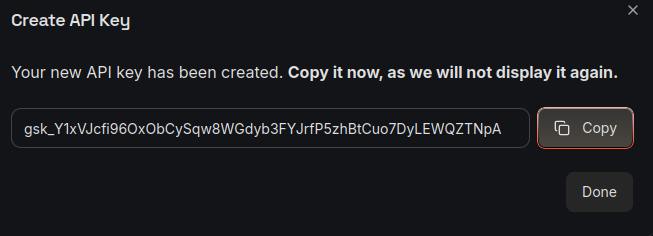
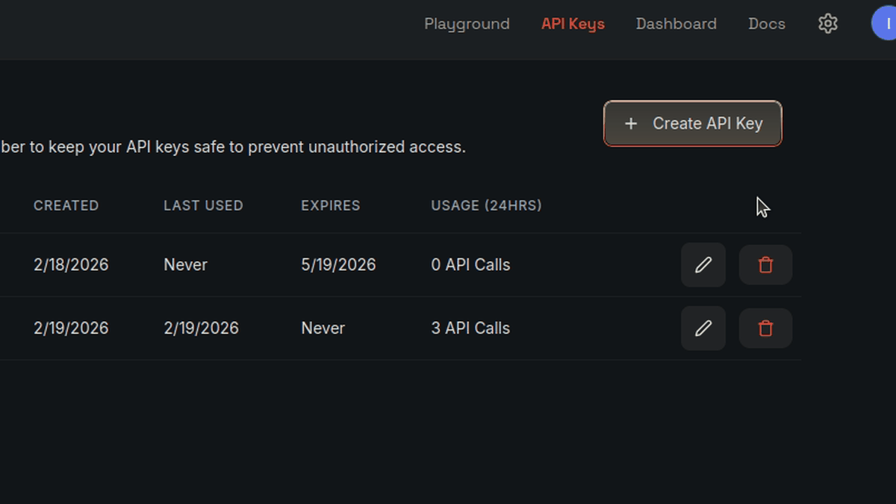

# getv — Universal .env Variable Manager

[](https://badge.fury.io/py/getv)
[](https://pypi.org/project/getv/)
[](https://opensource.org/licenses/Apache-2.0)
[](https://pypi.org/project/getv/)
[](https://github.com/wronai/getv/actions)

Read, write, encrypt, and delegate environment variables across services and devices.



Copy to the clipboard and run `getv grab` to detect and save the API key 

```bash
$ getv grab

Detected:  groq (GROQ_API_KEY)
Key:       gsk_Y1xV...TNpA
Source:    Prefix match
Domain:    console.groq.com
Category:  llm
Profile:   ~/.getv/llm/groq.env

Saved to /home/tom/.getv/llm/groq.env

Usage:
  getv get llm groq GROQ_API_KEY
  getv exec llm groq -- python app.py
```
without any plugins, managers, or integrations...

Clipboard → .env Auto-Detection
No other CLI tool has this feature. 
Copy any API key and run getv grab — it auto-detects the provider, saves to the right profile, and shows usage commands. Perfect for rapid RPi + LLM development workflow.

```bash
$ getv grab              # copy API key → auto-detect provider → save
$ getv exec llm groq -- python app.py   # run with profile injected
$ getv ssh rpi3 "uname -a"              # SSH using stored profile
```




## Why getv?

- **Clipboard → .env** — `getv grab` auto-detects 19 API key prefixes from clipboard
- **Built-in integrations** — SSH, curl, Docker, LiteLLM, Ollama, Pydantic — no plugins
- **Smart profiles** — organize by category (`llm/`, `devices/`, `tokens/`) with per-app defaults
- **One-liner power** — process substitution, pipes, shell eval

## Install

```bash
pip install getv                   # core
pip install "getv[crypto]"         # + encryption (Fernet)
pip install "getv[all]"            # everything
```

## Quick Start

```bash
# Save a profile
getv set llm groq LLM_MODEL=groq/llama-3.3-70b-versatile GROQ_API_KEY=gsk_xxx

# Read a variable
getv get llm groq LLM_MODEL

# List profiles (secrets masked)
getv list llm

# Run with env injected
getv exec llm groq -- python my_script.py

# Auto-detect API key from clipboard
getv grab

# Export formats
getv export llm groq --format json
getv export llm groq --format shell
getv export llm groq --format docker
```

### Python API

```python
from getv import EnvStore, ProfileManager

# Single .env file
store = EnvStore("~/.myapp/.env")
store.set("DB_HOST", "localhost").set("DB_PORT", "5432").save()

# Named profiles
pm = ProfileManager("~/.getv")
pm.add_category("llm", required_keys=["LLM_MODEL"])
pm.set("llm", "groq", {"LLM_MODEL": "groq/llama-3.3-70b-versatile", "GROQ_API_KEY": "gsk_xxx"})

# Merge profiles
cfg = pm.merge_profiles({"APP_NAME": "myapp"}, llm="groq", devices="rpi3")
```

## Profile Directory

```text
~/.getv/
├── .fernet.key            ← encryption key (chmod 600)
├── defaults/              ← per-app profile selections
│   ├── fixpi.conf         → llm=groq, devices=rpi3
│   └── prellm.conf        → llm=openrouter
├── devices/
│   ├── rpi3.env
│   └── rpi4-prod.env
├── llm/
│   ├── groq.env
│   └── openrouter.env
└── tokens/
    └── github.env
```

## CLI Reference

| Command | Description |
|---------|-------------|
| `getv set CATEGORY PROFILE KEY=VAL...` | Create/update profile |
| `getv get CATEGORY PROFILE KEY` | Get single value |
| `getv list [CATEGORY [PROFILE]]` | List categories/profiles/vars |
| `getv delete CATEGORY PROFILE` | Delete profile |
| `getv export CATEGORY PROFILE --format FMT` | Export (json/shell/docker/env/pydantic) |
| `getv encrypt CATEGORY PROFILE` | Encrypt sensitive values |
| `getv decrypt CATEGORY PROFILE` | Decrypt values |
| `getv exec CATEGORY PROFILE -- CMD...` | Run with profile env |
| `getv use APP CATEGORY PROFILE` | Set app default |
| `getv defaults [APP]` | Show app defaults |
| `getv ssh PROFILE [CMD]` | SSH to device |
| `getv curl PROFILE URL` | Authenticated API call |
| `getv grab [--dry-run]` | Auto-detect API key from clipboard |
| `getv diff CATEGORY A B` | Compare two profiles |
| `getv copy CAT/SRC CAT/DST` | Clone profile |
| `getv import FILE [CAT PROFILE]` | Import from .env / docker-compose |
| `getv init` | Interactive setup wizard |

## Documentation

| Document | Description |
|----------|-------------|
| [docs/INTEGRATIONS.md](docs/INTEGRATIONS.md) | SSH, LiteLLM, Ollama, Docker, curl, Pydantic, nfo, file watcher |
| [docs/GRAB.md](docs/GRAB.md) | Clipboard detection — 19 prefixes, browser history, Python API |
| [docs/SECURITY.md](docs/SECURITY.md) | Masking, Fernet encryption, key rotation, validation, format export |
| [docs/EXAMPLES.md](docs/EXAMPLES.md) | 20+ one-liner examples — pipes, process substitution, cron, Docker |
| [docs/COMPARISON.md](docs/COMPARISON.md) | getv vs direnv vs dotenvx vs envie |

## Environment Variables

| Variable | Default | Description |
|----------|---------|-------------|
| `GETV_HOME` | `~/.getv` | Base directory for profiles |

## Adopted by

- **[fixpi](https://github.com/zlecenia/c2004/tree/main/fixPI)** — SSH + LLM diagnostic agent
- **[prellm](https://github.com/wronai/prellm)** — LLM preprocessing proxy
- **[code2logic](https://github.com/wronai/code2logic)** — Code analysis engine
- **[amen](https://github.com/wronai/amen)** — Intent-iterative AI gateway
- **[marksync](https://github.com/wronai/marksync)** — Markdown sync server
- **[curllm](https://github.com/wronai/curllm)** — LLM-powered web automation

## Development

```bash
git clone https://github.com/wronai/getv.git
cd getv
python -m venv .venv && source .venv/bin/activate
pip install -e ".[dev]"
pytest  # 190 tests
```

## License

Apache License 2.0 - see [LICENSE](LICENSE) for details.

## Author

Created by **Tom Sapletta** - [tom@sapletta.com](mailto:tom@sapletta.com)
